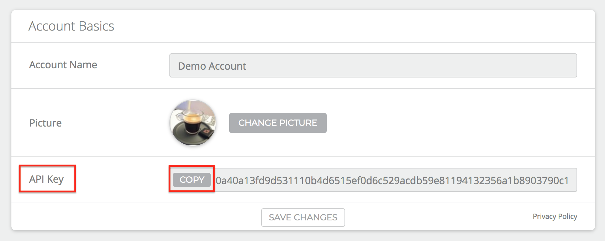
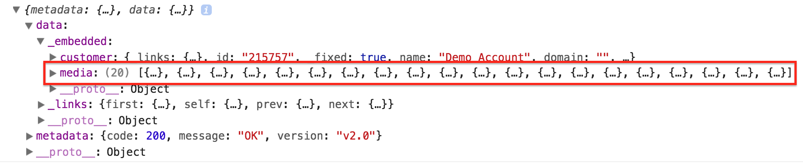
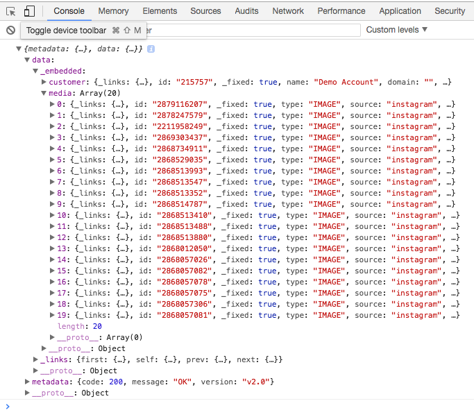
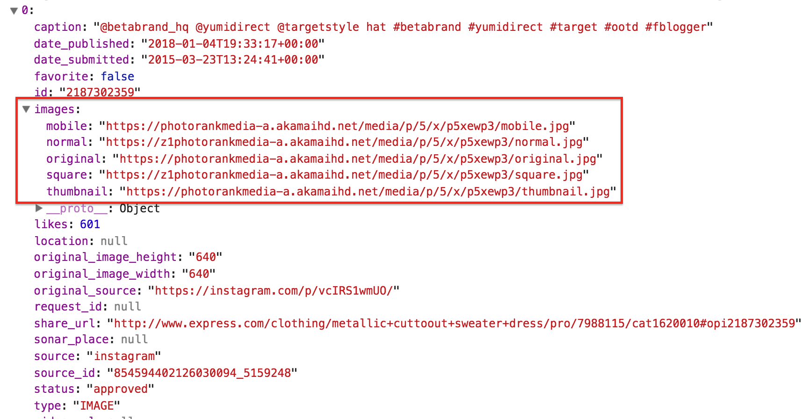
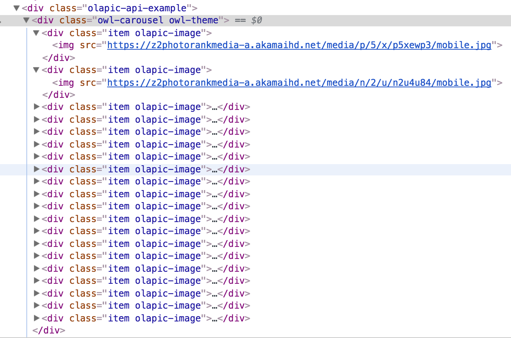

## Table of Contents

- [Overview](#overview)
- [Authentication](#authentication)
- [Into The Code](#into-the-code)
	- [HTML](#html)
	- [JavaScript](#javascript)
- [Finished Carousel](#finished-carousel-with-olapic-ugc)
- [Full Code](#full-code)

## Overview

For this tutorial, we will be using the Olapic API, Version 2.2 to display the most recently published images in a Carousel layout. Before we get started please review our [API Documentation](http://apiv2-docs.photorank.me/index.html).

## Authentication

### API Key

In order to make valid API calls, you'll need your API Key. This can be found in the Olapic platform for your account.

You can find your API Key in the Olapic Platform by clicking the Settings icon in the top right corner:

You'll then be able to copy the API Key:

{:width="600px"}

### Customer ID

You can hit our root endpoint using your API Key to return the customer related information. You'll see your customer ID in the embedded customer object.

Example request:

~~~ javascript
https://photorankapi-a.akamaihd.net?auth_token={api_key}&version=2.2
~~~

Example response:

~~~ javascript
{
	metadata: {
	code: 200,
	message: "OK",
	version: "v2.0"
	},
	data: {
		_links: {
			self: {
				href: "//photorankapi-a.akamaihd.net/?auth_token=0a40a13fd9d531110b4d6515ef0d6c529acdb59e81194132356a1b8903790c18&version=v2.2"
			}
		},
		_fixed: true,
		_embedded: {
			customer: {
				_links: {
					self: {
						href: "//photorankapi-a.akamaihd.net/customers/215757?auth_token=0a40a13fd9d531110b4d6515ef0d6c529acdb59e81194132356a1b8903790c18&version=v2.2"
					}
				},
				id: "215757",
				_fixed: true,
				name: "Demo Account",
				domain: "",
				template_dir: "demo",
				language: "en_US",
...
~~~

## Into The Code

Let's start setting up our code by simply creating our HTML, CSS and JS files.

For this exercise, I will be using jQuery to handle the AJAX call to the Olapic API and OwlCarousel to handle the carousel functionality.

[jQuery CDN](https://code.jquery.com/jquery/)

[OwlCarousel Plugin](https://owlcarousel2.github.io/OwlCarousel2/)

### HTML

We'll create an index.html page that will contain all of our HTML. Our <code><head></code> section will contain links to our stylesheets, JS files and any dependencies. Here is what it looks like so far:

~~~ html
<head>
	<meta name="viewport" content="width=device-width, initial-scale=1.0">

	<title>Olapic API Examples</title>

	<!-- CSS -->
	<link rel="stylesheet" type="text/css" href="css/owl.carousel.min.css">
	<link rel="stylesheet" type="text/css" href="css/owl.theme.default.min.css">
	<link rel="stylesheet" type="text/css" href="css/main.css">

	<!-- jQuery -->
	

	<!-- Owl Carousel JS-->
	

	<!-- main JS -->
	

</head>
~~~

The <code><body></code> section will be simple since we will be adding HTML via JavaScript. We will create two <code>
</code> containers. One as a parent container and one as a requirement for OwlCarousel to target.

~~~ html
<body>

	

		

	

</body>
~~~

### JavaScript

We'll need to create a main.js file that contains our JavaScript. This is linked to the index.html that will display our carousel. 

To make sure our JavaScript code is executed once the DOM is ready, we'll add the jQuery ready function:

~~~ javascript
$(document).ready(function(){
	
});
~~~

Inside this function is where we'll execute JavaScript that makes a call to the Olapic API and retreives the most recent media and displays it in the Carousel.

First, we'll create a function that will wrap our AJAX call. For the purpose of this tutorial, we'll call the function <code>getRecentMedia</code>.

~~~ javascript
$(document).ready(function(){
	
	var getRecentMedia = function (){

	};

});
~~~

Before we construct the AJAX call, we'll create a variable inside this function that will store the endpoint we want to call. Since the goal of this tutorial is to display the most recent images, we'll be making a call to the [Get Media of a Customer](http://apiv2-docs.photorank.me/index.html#media-endpoints-get-media-of-a-customer) endpoint.

The HTTP Request for this endpoint looks like:


GET 
/customers/{customer_id}/media/{sorting_option}?rights_given={rights_given}&include_tagged_galleries={include_tagged_galleries}


There are a few parameters to take note of here:

- **customer_id (required):** This is a numeric value that is the ID of the customer that "owns" this media. This is a required parameter.

- **sorting_option (required):** Changes the order of the media returned in the response. It’s used in requests where media lists are being returned. Here are the accepted parameter values and their definitions:
	- **recent:** sort the media list by chronological order (ascending).
	- **shuffled:** sort the media list by random order. The randomness is recomputed every 30 minutes.
	- **photorank:** sort the media list by photorank score. This score is predicted by the Olapic Machine Learning algorithm when the media object is registered in the system.
	- **rated:** sort the media list by the current Click Thru Rate of the media. This sorting assumes that the CTR is equal to 1.0 for all the media that are uploaded in the last 7 days or less.
	- **media_position:** This parameter is only available when requesting media associated to a particular stream (see [Get Media of a Stream](http://apiv2-docs.photorank.me/index.html#media-endpoints-get-media-of-a-stream)).This option sorts the media in the exact position selected for each media for that stream, which is configurable in the Olapic Admin tool.

- **rights_given (optional):** Filters media objects by their rights status. Accepted values are 0 (default) or 1. If 1 is provided for this parameter, only media with rights associated will be returned, and media without rights will be excluded from the list.

- **include_tagged_galleries (optional):** Filters embedded streams with status TAG. Accepted values are 0 or 1 (default). If 0 is provided for this parameter, streams with status TAG will be removed from the embedded objects in the response. Status TAG streams are streams that are not meant to be shoppable or have click throughs to PDPs.

Now that we understand all the parameteres available for this endpoint, we'll construct our request:

~~~ javascript
var olapicEndpoint = "https://photorankapi-a.akamaihd.net/customers/215757/media/recent?rights_given=0&include_tagged_galleries=0&auth_token=0a40a13fd9d531110b4d6515ef0d6c529acdb59e81194132356a1b8903790c18&version=v2.2";
~~~

Looking at the endpoint, we're calling on the most recent media of customer 215757, sorted by chronological order and does not need rights. We've also specified to remove any streams with status *TAG* from the embedded object in the response.

#### AJAX

Now let’s construct our AJAX call to this endpoint and see what the response looks like. For now, we’ll log the response in the console so that we know what to traverse when we start to extract data.

Here is what we have so far:

~~~ javascript
$(document).ready(function() {
	
	var getRecentMedia = function(){

		var olapicEndpoint = "https://photorankapi-a.akamaihd.net/customers/215757/media/recent?rights_given=0&include_tagged_galleries=0&auth_token=0a40a13fd9d531110b4d6515ef0d6c529acdb59e81194132356a1b8903790c18&version=v2.2";

		$.ajax({
	    		dataType: "json",
	    		url: olapicEndpoint,
	    		type: "GET",
	    		data: {
	    			format: "json"
	      		},
	      		success: function(data) {

	      			console.log(data);

	      		},
	      		error: function(error){

        			console.log(error);

        		}
    		});

	};

	getRecentMedia();

});
~~~

We’re making a GET request to this endpoint and expecting to receive a response in JSON format. If the response is returned successfully, we’ll log the response to the console. If there’s an error, we’ll log the error to the console. 

**Console:** 

{:width="700px"}

After traversing the response, we see the media object lives within <code>data._embedded.media</code>. Let’s capture this in a variable so that we can iterate through the array in this object.

~~~ javascript
success: function(data) {
	console.log(data);

	var mediaObject = data.data_embedded.media;

	console.log(mediaObject);
~~~

If we log the mediaObject variable to the console, we should see the array of medias:

{:width="700px"}

We’ll want to iterate through this to grab the URL of the media so that we can display it in the carousel. 

Let’s look at first media object to see where we can find the URL hosting the image.

{:width="700px"}

Looking at the first media object, we see the images object property contains five different versions of the asset. Here are the specifications of each version of the asset:

- **Square:** 90x90px image. Cropped, does not maintain original ratio.
- **Thumbnail:** 150x150px image. Maintains original ratio.
- **Mobile:** 320x320px image. Maintains original ratio.
- **Normal:** 640x640px image. Maintains original ratio.
- **Original:** original image without modifications.

Now that we know where in the media object to get the image URL, we will construct a FOR loop that will loop through our mediaObject variable. Each time it hits a media object in the array we’ll store the mobile image asset in a variable and append HTML inside the owl-carousel <code>
</code>.

~~~ javascript
for (x=0; x < mediaObject.length; x++) {
	var mediaItem = mediaObject[x];

	console.log(mediaItem);

	var olapicImage = mediaItem.images.mobile;

	$(".owl-carousel").append("

div>");
};
~~~

The end result is 20 additional <code>
</code> containers with <code>img</code> tags appended inside the owl-carousel <code>
</code>

{:width="500px"}

We now know it’s working so we can move on to setting up the carousel.

#### Carousel

To configure OwlCarousel, refer to their [documentation](https://owlcarousel2.github.io/OwlCarousel2/docs/started-installation.html) and available [options](https://owlcarousel2.github.io/OwlCarousel2/docs/api-options.html) from their API.

The basic setup requires us to use their CSS, JS and jQuery:

~~~ html
<link rel="stylesheet" href="owlcarousel/owl.carousel.min.css">
~~~

~~~ javascript

~~~

Looking back at our HTML example in the beginning of this tutorial, you’ll notice I’ve already included these files.

We need a container <code>
</code> with the class <code>.owl-carousel</code>. This let’s owl-carousel know what container to target.

Lastly, we need to call the plugin::

~~~ javascript
$(".owl-carousel").owlCarousel();
~~~

Utilizing a few of the OwlCarousel API options, the implementation looks like:

~~~ javascript
$(".owl-carousel").owlCarousel({
  items: 4,
  loop: true,
  touchDrag: true,
  nav: true,
  navText: ["<i class='arrow left'></i>", "<i class='arrow right'></i>"],
  dots: false,
  video: true,
  responsive: {
    0: {
      items:1,
      center:true
    },
    414: {
      items: 2
    },
    550: {
      items:3
    },
    1000: {
      items:4
    }
  }
});
~~~

And that’s it! You now have a working Image Carousel that is streaming your Olapic UGC.

With some additional CSS, you can style the carousel as you please to match your brand design guidelines. 

## Finished Carousel with Olapic UGC

{:width="700px"}

## Full Code

You can view the full code for this tutorial [here](https://gist.github.com/d-lange-SA/73d0443c87c83256dad34264e8403efa).

