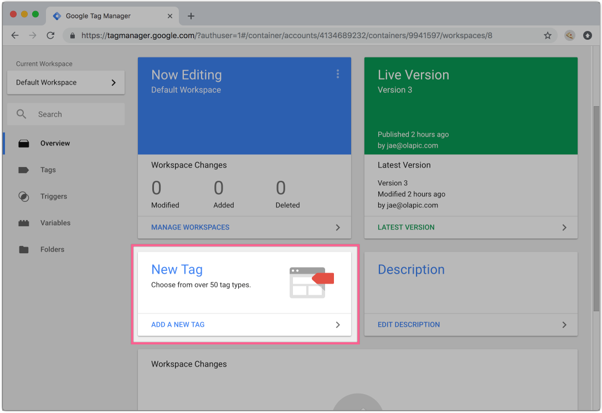
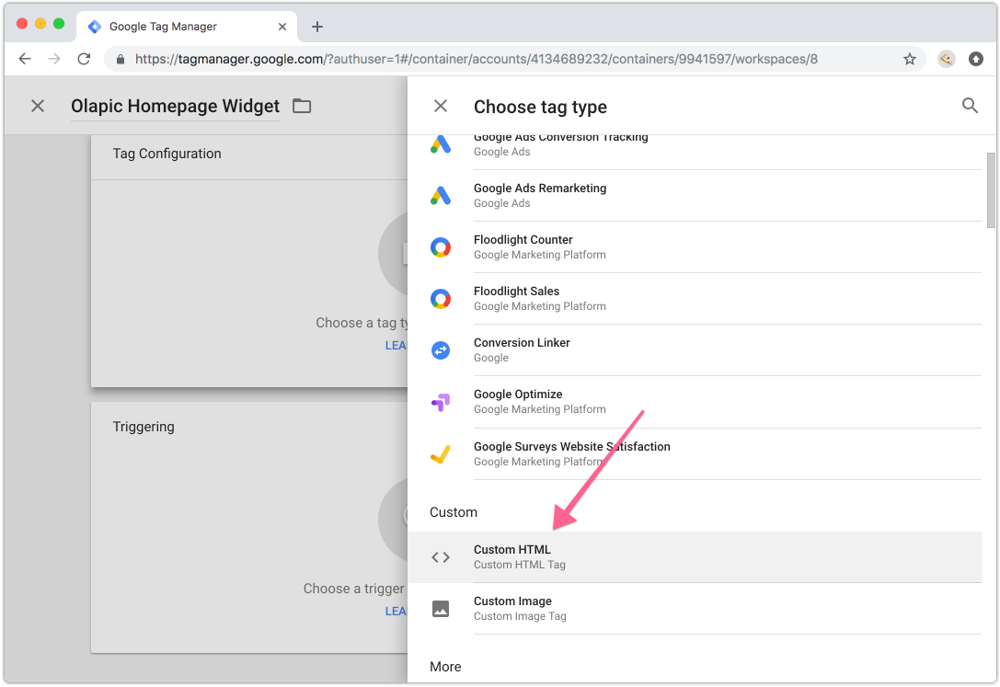
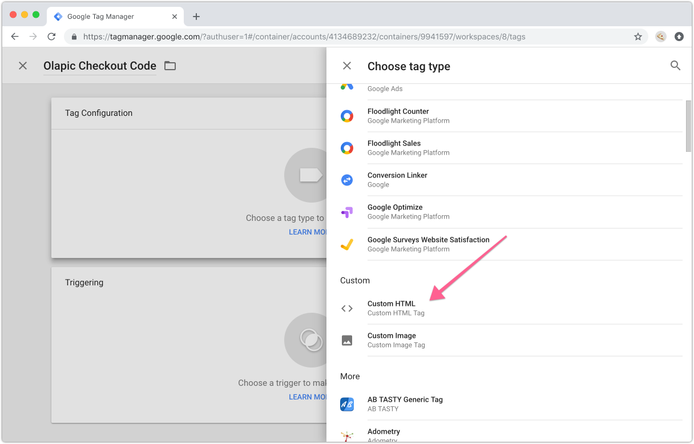
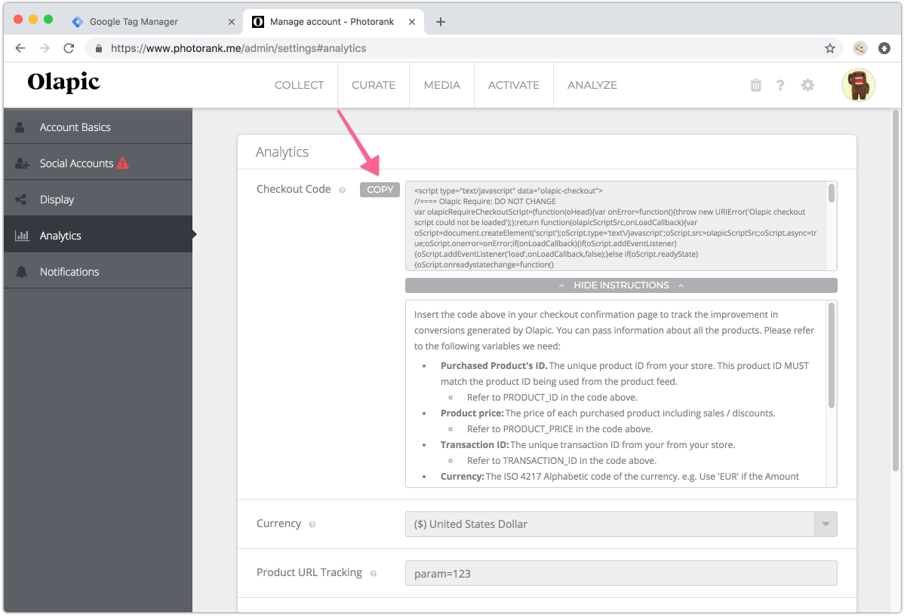
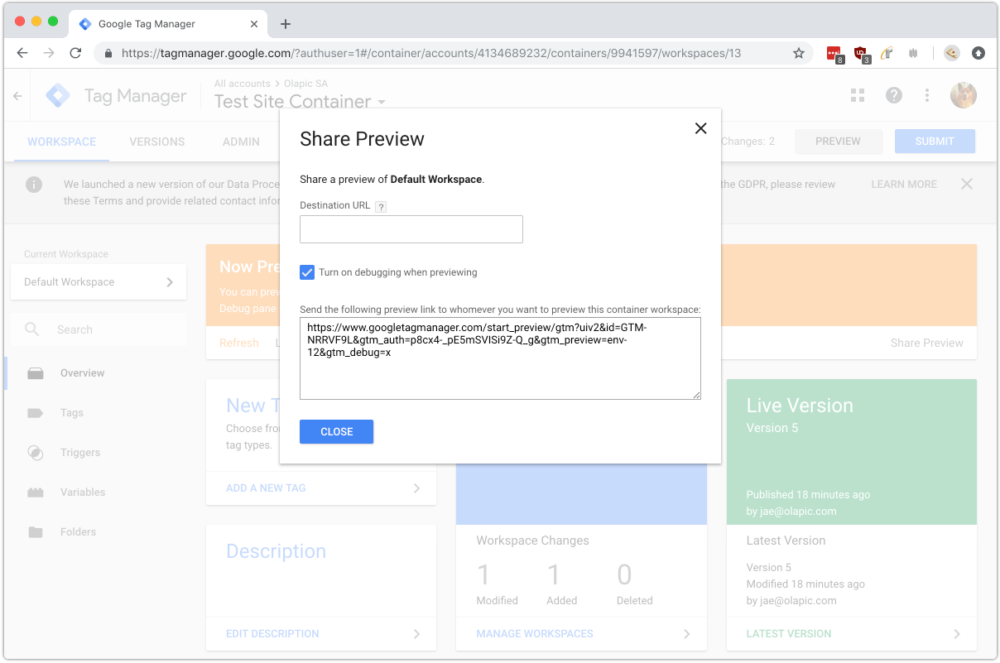

The following document covers the installation steps necessary for implementing Olapic widgets and checkout code via [Google Tag Manager](https://marketingplatform.google.com/about/tag-manager/){:target="_blank"}.

## Widget Instance Code as a Tag
You can implement the Olapic Javascript Widget either in a *static* context (i.e., UGC widget on homepage or standalone gallery page) or in a *dynamic* context (i.e., UGC widget on product page or category page) using Google Tag Manager.

For more details on different types of content sources you can retrieve in a widget, please refer to our Help Desk article: [Widget Management > Source](https://olapic1.zendesk.com/hc/en-us/articles/201605174-Widget-Management-Source#-widget-management-source){:target="_blank"}.

### Implementing the Widget Instance

The following step-by-step will walk you through the necessarys steps required to configure the Olapic widget as a tag.

1. In your Google Tag Manager dashboard, click on "Add A New Tag".

    


2. Give your tag a name (i.e., "Olapic Homepage Widget"), and choose Custom HTML as the tag type.

    

3. Copy and paste the following code snippet into the HTML text field:

    ```html
    <script>
    var olapicRequireWidgetScript=function(d){var i=function(){throw new URIError("Olapic Widget script could not be loaded.")};return function(t,e){var a=document.createElement("script");a.type="text/javascript",a.src="//photorankstatics-a.akamaihd.net/743d2e78a76dedeb07e0745158547931/static/frontend/latest/build.min.js",a.async=!0,a.onerror=i,a.setAttribute("data-olapic",t.targetDivId),a.setAttribute("data-instance",t.widgetInstanceId),a.setAttribute("data-apikey",t.widgetApiKey),"widgetTagKey"in t&&a.setAttribute("data-tags",t.widgetTagKey),e&&(a.addEventListener?a.addEventListener("load",e,!1):a.readyState?a.onreadystatechange=function(){this.readyState&&"loaded"!==this.readyState&&"complete"!==this.readyState||e()}:a.attachEvent("load",e)),d.appendChild(a)}}(document.head||document.getElementsByTagName("head")[0]);

    olapicRequireWidgetScript({
      targetDivId: 'olapic_specific_widget',
      widgetInstanceId: 'INSERT INSTANCE ID HERE',
      widgetApiKey: 'INSERT API KEY HERE'
    });
    </script>
    ```


4. Swap out the object props used by the `olapicRequireWidgetScript` function from the appropriate values from the original widget code:

    ```js
    olapicRequireWidgetScript({
      targetDivId: 'olapic_specific_widget', // ID of the target <div>
      widgetInstanceId: 'INSERT INSTANCE ID HERE', // Instance ID of the Olapic Widget Instance
      widgetApiKey: 'INSERT API KEY HERE', // API Key of the Olapic account
    });
    ```

    The values for `widgetInstanceId` and `widgetApiKey` values can be found within the Olapic widget code generated in the Widget Manager section within the Olapic admin (screenshot below).

    

    <div class="bs-callout bs-callout-warning">
        <h4>Container div element</h4>
        Olapic widget script will inject the content dynamically to the specificed element in the DOM. If the element is not present on the the source level, you will need to insert the container div element via Javascript before the tag load or on page source level.
    </div>

5. **Optional**. If you are implementing the widget in a static context, skip to Step 6.

    In order to retrieve product or category specific content in the Olapic widget, you can use the `widgetTagKey` object prop to pass the appropriate variable from the page to the tag. This part assumes that your Olapic account is configured with a Product Feed.
    
    Insert the appropriate variable to the `widgetTagKey` object prop in the options object:

    ```js
    olapicRequireWidgetScript({
      targetDivId: 'olapic_specific_widget', // ID of the target <div>
      widgetInstanceId: 'XXXXXXX', // Instance ID of the Olapic Widget Instance
      widgetApiKey: 'XXXXXX', // API Key of the Olapic account
      widgetTagKey: '{{Product ID}}' // External identifier used for Dynamic Source
    });
    ```

    <div class="bs-callout bs-callout-info">
        <h4>Variable for widgetTagKey</h4>
        The variable name comes from the either built-in or user-defined variables. For more information, please see the official Google Tag Manager documentation: <a href="https://support.google.com/tagmanager/answer/7683362" target="_blank">https://support.google.com/tagmanager/answer/7683362</a>
    </div>


6. Set the appropriate Tag firing options (`Once per page` is recommended), then select the appropriate Trigger Rule for the tag. 

    Trigger Rules are different for different types of pages. E.g., Trigger Rule for your product page may have a fire rule of "Page Path contains /product/".

7. Save and publish the changes to the container in the current workspace. Once published, check the site page that matches the load rule to ensure the widget is loading correctly.

## Checkout Code as a Tag
Implementing the Olapic Checkout Code allows you to send important data from your conversion funnel to Olapic. Once implemented, Olapic will be able to analyze the conversion funnel closely, and provide valuable insight in your Analytics dashboard.

Please note that the checkout code tag implementation will highly depend on how the transaction data is can be accessed by Google Tag Manager.

There are various ways that the order data can be surfaced on the page:
* Global Javascript Object
* Data Layer via Google Tag Manager ([https://support.google.com/tagmanager/answer/6107169?hl=en](https://support.google.com/tagmanager/answer/6107169?hl=en){:target="_blank"})
* User-defined Variables

The checkout code is implemented on your e-commerce site's order confirmation page. Specifically, on the "Order Confirmation" page that shows after the user has submitted the order to be processed.

### Implementing the Checkout Code

The following step-by-step will walk you through the necessarys steps required to configure the Olapic widget as a tag.

1. In your Google Tag Manager dashboard, click on "Add A New Tag".

    


2. Give your tag a name (i.e., "Olapic Checkout Code"), and choose Custom HTML as the tag type.

    

3. In the [Settings](https://www.photorank.me/admin/settings#analytics){:target="_blank"} page of your Olapic account, locate the Checkout Code annd copy & paste the snippet into the HTML text field.

    

4. You now need to modify the Javascript to map the transaction data you're surfacing in the checkout confirmation page. For more details on how to modify the checkout code, please refer to the [Checkout Code Implementation Guide](http://developer.olapic.com/articles/checkout-pixel-implementation-v2-public.html#instructions).

    Here's an example of how the data layer code might be implemented using the Data Layer using Standard Ecommerce method:

    ```html
    <script>
    window.dataLayer = window.dataLayer || [];
    dataLayer.push({
      'transactionId': '1234',
      'transactionAffiliation': 'Acme Clothing',
      'transactionTotal': 38.26,
      'transactionTax': 1.29,
      'transactionShipping': 5,
      'transactionProducts': [{
        'sku': 'DD44',
        'name': 'T-Shirt',
        'category': 'Apparel',
        'price': 11.99,
        'quantity': 1
      },{
        'sku': 'AA1243544',
        'name': 'Hat',
        'category': 'Apparel',
        'price': 9.99,
        'quantity': 2
      }]
    });
    </script>
    ```

    Assuming the variables configured within Google Tag Manager with the appropriate variable names (`transactionId` should map to `Transaction ID`, `transactionProducts` should map to `Transaction Products`), you can refer to the following pre-mapped code:

    ```html
    <script type="text/javascript" data="olapic-checkout">
    //==== Olapic Require: DO NOT CHANGE
    var olapicRequireCheckoutScript=(function(oHead){var onError=function(){throw new URIError('Olapic checkout script could not be loaded');};return function(olapicScriptSrc,onLoadCallback){var oScript=document.createElement('script');oScript.type='text\/javascript';oScript.src=olapicScriptSrc;oScript.async=true;oScript.onerror=onError;if(onLoadCallback){if(oScript.addEventListener){oScript.addEventListener('load',onLoadCallback,false);}else if(oScript.readyState){oScript.onreadystatechange=function(){if(!this.readyState||this.readyState==='loaded'||this.readyState==='complete'){onLoadCallback();}};}else{oScript.attachEvent('load',onLoadCallback);}}
    oHead.appendChild(oScript);};})(document.head||document.getElementsByTagName('head')[0]);

    // ==== Checkout Code:
    olapicRequireCheckoutScript('//photorankstatics-a.akamaihd.net/static/frontend/checkout/olapic.checkout.helper.js', function(){
      // Initialization
      olapicCheckout.init('INSERT API KEY HERE');

      // Product loop begins
      var transactionProducts = {{Transaction Products}};
      for (var index = 0; index < transactionProducts.length; index++) {
        var product = transactionProducts[index];
        for (var c = product.quantity - 1; c >= 0; c--) {
          olapicCheckout.addProduct(product.sku, product.price);
        };
      }

      // Add the metadata/attributes
      olapicCheckout.addAttribute('transactionId', {{Transaction ID}});
      olapicCheckout.addAttribute('currencyCode', 'USD');

      // Send the information
      olapicCheckout.execute();
    });
    </script>
    ```

    Swap out the `INSERT API KEY HERE` with the API key from your account. This can be referenced from the copied checkout code from the Settings page of the Olapic admin.

    Note that value for `currencyCode` should be swapped out with the appropriate ISO currency code.

    <div class="bs-callout bs-callout-info">
        <h4>Variables</h4>
        The variable name comes from the either built-in or user-defined variables. You will need to customize the above code to refer to the correct variable names or custom data object from the page. For more information, please see the official Google Tag Manager documentation: <a href="https://support.google.com/tagmanager/answer/7683362" target="_blank">https://support.google.com/tagmanager/answer/7683362</a>
    </div>

6. Set the appropriate Tag firing options (`Once per page` is recommended), then select the appropriate Trigger Rule for the tag. 

    Trigger Rules are different for different types of pages. E.g., Trigger Rule for your order confirmation may have a fire rule of "Page URL contains `checkout`".

7. Save the changes to the container in the current workspace. Once saved, you can preview the current configuration by using the Preview functionality and checking the site page that matches the load rule.

    If you need any further assistance with implementing the tag in Google Tag Management, please reach out to your Solutions Architect with the Preview link associated with your workspace.

    