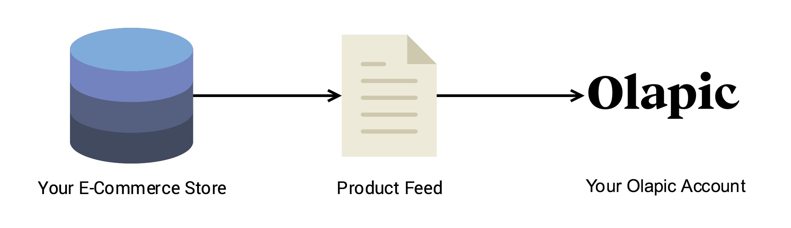
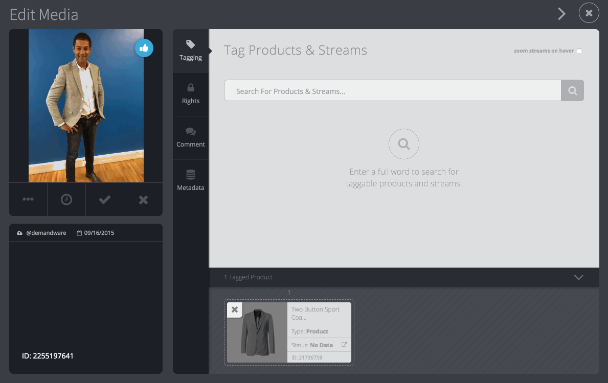
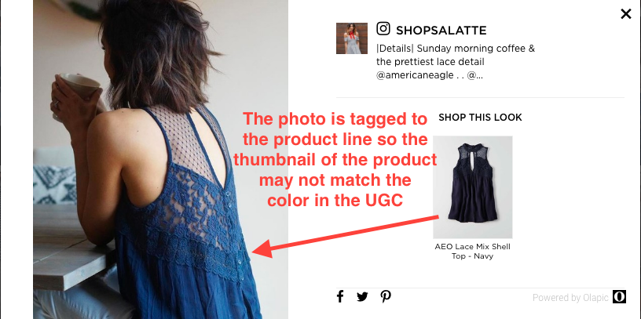
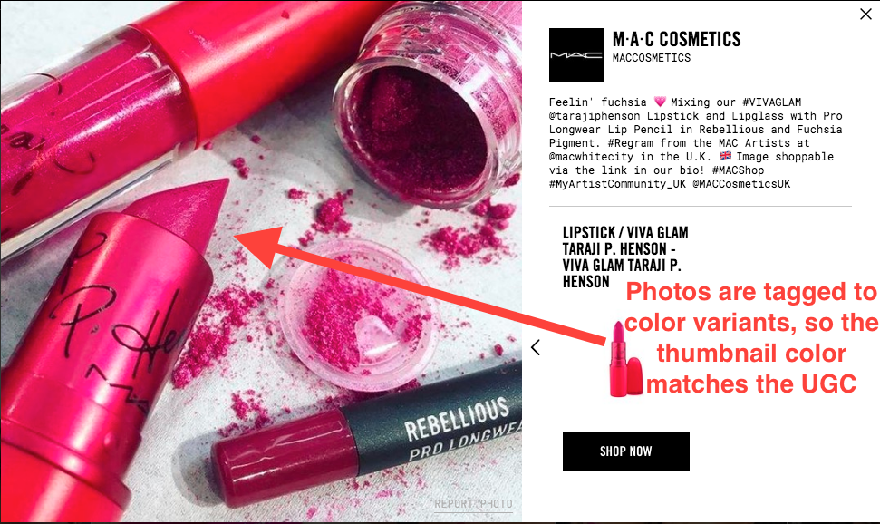
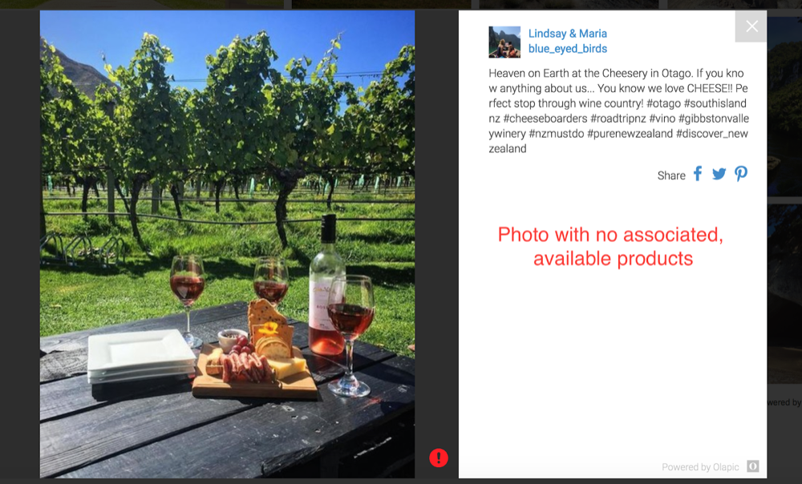

{:width="600px" class="no-shadow"}

The Product Feed (sometimes referred to as "PF") is important because it unlocks many important features of the Olapic platform, such as: media syndication, shoppability, content organization, automatic updates, and more. Via the PF, we can import the product catalog data on your e-commerce website in an automated fashion. This includes product metadata such as: product name, product URL, product image URL, product availability, category information, etc.

{:width="600px"}

When we process your Product Feed, each product from the Product Feed becomes a stream. You can think of streams as folders. When Olapic collects content on behalf of your brand, the content must be organized and tagged to different streams as they pass through the curation process. Once Olapic processes your Product Feed, you are able to tag the content to the streams that mirror the products from your Product Feed. The point being, you're matching the product that is represented in the user-generated image.

{:width="600px"}

With the product streams created in your Olapic account and the content tagged to corresponding product streams, Olapic widgets implemented across your site can display the user-generated images, along with the products tagged to the content. Your site visitors can interact with the user-generated content and click on the tagged products to navigate to the corresponding product page. This helps drive click-through to product pages & ultimately lead the visitor to conversion.

While you can create the product streams manually in the Olapic dashboard, it's much harder to create a shoppable experience out of your user-generated content (UGC) in an automated fashion without the Product Feed, especially if your product catalog consists of hundreds to thousands of products. The Product Feed allows us to import your catalog at scale as well as maintain the most up-to-date state of your products.

**In short, here are main functions of a Product Feed:**

* **Stream Creation**

	Automatic product stream (folder) creation in the Olapic platform for each unique product on your product feed.
	Each stream will automatically include the name, product URL, image URL, and product ID (and any extra information) from your product feed.

* **Enable Shoppable Content**

	In order to make user-generated-content shoppable, it needs to be "tagged" to a product stream within the platform. Therefore, the product feed fuels the shoppable experience.
	The "Shop This Look" area of the media lightbox features tagged product streams and the product link.

* **Platform Sync**
	
	Olapic processes your Product Feed daily, which means our platform will stay in-sync with your product catalog data as changes are introduced on the e-commerce platform.
	
	Updates to the product names, product URLs or images can be made easily & automatically by the feed.

	Products can be added or removed or flagged as out of stock easily via the feed.

* **Multi-Account Setup**

	Product Feed integration is a pre-requisite of the multi-account structure.
	
	Images tagged to product streams in the master account can be synced with the related child accounts as long as the matching product streams exist on both master and child accounts.

# What type of feed is the best for the Olapic integration?

Although Olapic can support a custom schema feed, sending the Product Feed in an Olapic schema enables your brand to take full advantage of feature set available in the Olapic platform. 

At a high level, here are main advantages of using an Olapic Product Feed:

* Faster integration time (speedier feed validation & import)
* Ability to remove products or delete completely.
* Supports multiple Universal ID (UPC, EAN) per product
* Supports multiple categories per product
* Enables support for Category Widgets
* Automated feed validation (syntax issues, broken URLs, etc.)

Here are the in-depth explanations and examples of each point mentioned above:

* **Faster integration time**
	
	Typically the product feed integration is the most crucial step during onboarding. Olapic can significantly speed up the implementation time required to automate a product feed if your brand provides an Olapic Product Feed. This allows your brand to go live with Olapic sooner!

* **Product Deletion Functionality**

	You can delete product streams by marking them in the Olapic schema feed, keeping the product data within your brand's Olapic account to stay clean without build-up of old product inventory.

* **Multiple UPC association**

	You can associate multiple UPC's to a product using an Olapic Schema. Whereas in a custom feed, a Brand is limited to a single UPC association per parent product. This is one of the requirements for brand-to-retailer syndication feature.

* **Multiple Category association**

	You can associate multiple categories to a product using the Olapic Schema. Whereas in a custom feed, a Brand is limited at a single category association per product, typically either the highest level or most granular level.

	This is an important feature as it allows for better use of Dynamic Category widgets, as well as enabling category filters on gallery widgets.

	As an example, if you go to Brand's website and look under the Product's section, a user can usually see the product hierarchy. If you see a product is within Category A, that same product could also be associated to Category B or C. However, the Brand would be forced to pick only one of the categories to associate the product with if using a custom feed. This would limit how many category pages you could place an Olapic UGC widget on. 

* **Automated Feed Validation**

	With an Olapic Product Feed, Olapic will validate your Olapic Product Feed against the Olapic Schema validator upon every import. This means that if there is ever a syntax issue with any given XML nodes, our Support Team is alerted and are able to follow up with your technical contacts. With a custom feed implementation, the responsibility is on your Brand to validate the feed against your own schema and ensure that that there are no issues. If there is a syntax error in the feed, that product is skipped and not imported.

* **Faster modifications to feed structure**

	If something in the feed needs to be changed / updated (ex: add category information to the feed), there is typically less coordination or implementation updates that need to be made on Olapic's side to support the change in the case of an Olapic Product Feed.

	* You should still notify your Olapic contact if you are making changes to your Product Feed so we can advise and monitor.

	Whereas typically an update to a custom feed requires implementation and code review effort on Olapic's side.

	* Since everything is manually mapped for a custom feed, an update to a custom feed will also typically require an update on Olapic's side.

# Business Requirements for the Product Feed

Beyond determining what feed format to send the Product Feed in & the minimum required fields, another important piece of the Product Feed is determining which Product Hierarchy fits your UX needs in the front-end display of the website. Here are the Product Hierarchy types that you can include in your Product Feed and the UX impacts to consider.

* **Single-level Product Hierarchy**
* **Multi-level Product Hierarchy**

Let's dive into the UX impacts of each Product Hierarchy types.

##  Single-level Product Hierarchy

Single-level Product Hierarchy features products in the Product Feed represented as standalone products, without any relationships to other products.

When using this Product Hierarchy type, you will be tagging collected images to parent products (we also call this a "master level" product).

**UX Outcome:** The product line is shown as the associated product in the Olapic media lightbox. The user is able to navigate to the product display page and then decide which color they want to view/purchase.

{:width="600px"}

This is typically the cleanest and easiest option. Your Olapic account will be tidier, moderation will be quick and easy with this option as there are less Product streams to search against. Creating the feed is typically easier as well.

The XML in the Product Feed would look something like this:

```xml
<?xml version="1.0" encoding="UTF-8"?>
<Feed>
    <Products>
        <Product>
            <Name>Awesome Possum T-shirt</Name>
            <ProductUniqueID>APTS</ProductUniqueID>
            <ProductUrl>http://www.myawesomestore.com/products/APTS</ProductUrl>
            <ImageUrl>http://www.myawesomestore.com/images/APTS.jpg</ImageUrl>
        </Product>
        <Product>
            <Name>Bedazzled Jeans</Name>
            <ProductUniqueID>BDZJ</ProductUniqueID>
            <ProductUrl>http://www.myawesomestore.com/products/BDZJ</ProductUrl>
            <ImageUrl>http://www.myawesomestore.com/images/BDZJ.jpg</ImageUrl>
        </Product>
        <Product>
            <Name>Fluffy Sweater</Name>
            <ProductUniqueID>FFFS</ProductUniqueID>
            <ProductUrl>http://www.myawesomestore.com/products/FFFS</ProductUrl>
            <ImageUrl>http://www.myawesomestore.com/images/FFFS.jpg</ImageUrl>
        </Product>
    </Products>
</Feed>
```

**XML Explained:** Each `<Product>` node represents an individual product at the master level (terminology may differ depending on e-commerce systems and businesses). No specific color-variant products are included in the feed.

## Multi-level Product Hierarchy

Multi-level Product Hierarchy features products in the Product Feed represented as grouped products with relationships that link back to master level products.

When using this Product Hierarchy type, you will be tagging collected images to variant products (also may be referred to as "SKU level" products).

**UX Outcome:** The product with the matching color is shown as the associated product in the lightbox. Tagging the content to the variant products also automatically tags to the master level product. This also gives you the option to display all color variants in a PDP widget, while having the color specific variant display in the lightbox.

{:width="600px"}

This type of hierarchy support is most beneficial for brands where featuring colorways of the products is especially important, such as cosmetic brands.

The XML in the Product Feed would look something like this:

```xml
<?xml version="1.0" encoding="UTF-8"?>
<Feed>
    <Products>
        <Product>
            <Name>Awesome Possum T-shirt</Name>
            <ProductUniqueID>APTS</ProductUniqueID>
            <ProductUrl>http://www.myawesomestore.com/products/APTS</ProductUrl>
            <ImageUrl>http://www.myawesomestore.com/images/APTS.jpg</ImageUrl>
        </Product>
        <Product>
            <Name>Awesome Possum T-shirt in Blue</Name>
            <ProductUniqueID>APTS-BLUE</ProductUniqueID>
            <ProductUrl>http://www.myawesomestore.com/products/APTS?sku=BLUE</ProductUrl>
            <ImageUrl>http://www.myawesomestore.com/images/APTS-BLUE.jpg</ImageUrl>
            <Color>Blue</Color>
            <ParentID>APTS</ParentID>
        </Product>
        <Product>
            <Name>Bedazzled Jeans</Name>
            <ProductUniqueID>BDZJ</ProductUniqueID>
            <ProductUrl>http://www.myawesomestore.com/products/BDZJ</ProductUrl>
            <ImageUrl>http://www.myawesomestore.com/images/BDZJ.jpg</ImageUrl>
        </Product>
        <Product>
            <Name>Bedazzled Jeans with Hello Kitty</Name>
            <ProductUniqueID>BDZJ-HK</ProductUniqueID>
            <ProductUrl>http://www.myawesomestore.com/products/BDZJ?sku=BDZJ-HK</ProductUrl>
            <ImageUrl>http://www.myawesomestore.com/images/BDZJ-HD.jpg</ImageUrl>
            <ParentID>BDZJ</ParentID>
        </Product>
        <Product>
            <Name>Fluffy Sweater</Name>
            <ProductUniqueID>FFFS</ProductUniqueID>
            <ProductUrl>http://www.myawesomestore.com/products/FFFS</ProductUrl>
            <ImageUrl>http://www.myawesomestore.com/images/FFFS.jpg</ImageUrl>
        </Product>
        <Product>
            <Name>Fluffy Sweater with Sleepy Panda</Name>
            <ProductUniqueID>FFFS-SP</ProductUniqueID>
            <ProductUrl>http://www.myawesomestore.com/products/FFFS?sku=SP</ProductUrl>
            <ImageUrl>http://www.myawesomestore.com/images/FFFS-SP.jpg</ImageUrl>
            <ParentID>FFFS</ParentID>
        </Product>
    </Products>
</Feed>
```

**XML Explained:** The first `<Product>` node contains the master level product. The second product node represent the same T-Shirt as the master level product, but in the `Blue` color. You'll notice they each have their own `<ProductUniqueID>`, but the color variant one have extra elements: `<Color>` and `<ParentID>`. `<ParentID>` references the master level product ID. We will use the `<ParentID>` value to create the relationships in our system. The `<Color>` node is optional but included in the above example for clarity. You will see the same logic for representing the relationship in the rest of the products as well.

## Categories

**Categories** are groups of products within the Olapic platform. If a product is associated with a category, then any content tagged to that product is automatically associated with that category.

Categories can be leveraged in multiple ways, the most notable features enabled by Category relationship are:

* Display content by category via Olapic JS widgets or Olapic REST API
* Category filters in Gallery widget

### Content by Category

In the below example, we are showing an implemnetation of Olapic JS widget on a category level page on an e-commerce site. We are using the category ID to dynamically return the UGC that's tagged to product streams that are related to the specific category defined in the Product Feed. 

{:width="600px"}

### Category Filters in Gallery widget

Another use case for Categories in the Product Feed is the Category Filters (requires Olapic JS Widget). In below screengrab, you will see a Gallery type widget featuring a filter selection that allows the user to view different content based on the categories defined in the Product Feed.

{:width="600px"}

### Example XML

Here's an example of what the Product Feed looks like with Categories defined:

```xml
<?xml version="1.0" encoding="UTF-8"?>
<Feed>
    <Categories>
        <Category>
            <CategoryUniqueID>cat1001</CategoryUniqueID>
            <Name>Men's</Name>
            <CategoryUrl>http://www.myawesomestore.com/categories/mens</CategoryUrl>
        </Category>
        <Category>
            <CategoryUniqueID>cat1002</CategoryUniqueID>
            <Name>T-shirts</Name>
            <CategoryUrl>http://www.myawesomestore.com/categories/mens/tshirts</CategoryUrl>
        </Category>
        <Category>
            <CategoryUniqueID>cat1003</CategoryUniqueID>
            <Name>Sweaters</Name>
            <CategoryUrl>http://www.myawesomestore.com/categories/mens/sweaters</CategoryUrl>
        </Category>
        <Category>
            <CategoryUniqueID>cat2001</CategoryUniqueID>
            <Name>Women's</Name>
            <CategoryUrl>http://www.myawesomestore.com/categories/womens</CategoryUrl>
        </Category>
        <Category>
            <CategoryUniqueID>cat2002</CategoryUniqueID>
            <Name>Women's Jeans</Name>
            <CategoryUrl>http://www.myawesomestore.com/categories/womens/jeans</CategoryUrl>
        </Category>
    </Categories>
    <Products>
        <Product>
            <Name>Awesome Possum T-shirt</Name>
            <ProductUniqueID>APTS</ProductUniqueID>
            <ProductUrl>http://www.myawesomestore.com/products/APTS</ProductUrl>
            <ImageUrl>http://www.myawesomestore.com/images/APTS.jpg</ImageUrl>
            <CategoriesID>
                <CategoryID>cat1001</CategoryID>
                <CategoryID>cat1002</CategoryID>
            </CategoriesID>
        </Product>
        <Product>
            <Name>Awesome Possum T-shirt in Blue</Name>
            <ProductUniqueID>APTS-BLUE</ProductUniqueID>
            <ProductUrl>http://www.myawesomestore.com/products/APTS?sku=BLUE</ProductUrl>
            <ImageUrl>http://www.myawesomestore.com/images/APTS-BLUE.jpg</ImageUrl>
            <CategoriesID>
                <CategoryID>cat1001</CategoryID>
                <CategoryID>cat1002</CategoryID>
            </CategoriesID>
            <Color>Blue</Color>
            <ParentID>APTS</ParentID>
        </Product>
        <Product>
            <Name>Bedazzled Jeans</Name>
            <ProductUniqueID>BDZJ</ProductUniqueID>
            <ProductUrl>http://www.myawesomestore.com/products/BDZJ</ProductUrl>
            <ImageUrl>http://www.myawesomestore.com/images/BDZJ.jpg</ImageUrl>
            <CategoriesID>
                <CategoryID>cat2001</CategoryID>
                <CategoryID>cat2002</CategoryID>
            </CategoriesID>
        </Product>
        <Product>
            <Name>Bedazzled Jeans with Hello Kitty</Name>
            <ProductUniqueID>BDZJ-HK</ProductUniqueID>
            <ProductUrl>http://www.myawesomestore.com/products/BDZJ?sku=BDZJ-HK</ProductUrl>
            <ImageUrl>http://www.myawesomestore.com/images/BDZJ-HD.jpg</ImageUrl>
            <CategoriesID>
                <CategoryID>cat2001</CategoryID>
                <CategoryID>cat2002</CategoryID>
            </CategoriesID>
            <ParentID>BDZJ</ParentID>
        </Product>
        <Product>
            <Name>Fluffy Sweater</Name>
            <ProductUniqueID>FFFS</ProductUniqueID>
            <ProductUrl>http://www.myawesomestore.com/products/FFFS</ProductUrl>
            <ImageUrl>http://www.myawesomestore.com/images/FFFS.jpg</ImageUrl>
            <CategoriesID>
                <CategoryID>cat1001</CategoryID>
                <CategoryID>cat1003</CategoryID>
            </CategoriesID>
        </Product>
        <Product>
            <Name>Fluffy Sweater with Sleepy Panda</Name>
            <ProductUniqueID>FFFS-SP</ProductUniqueID>
            <ProductUrl>http://www.myawesomestore.com/products/FFFS?sku=SP</ProductUrl>
            <ImageUrl>http://www.myawesomestore.com/images/FFFS-SP.jpg</ImageUrl>
            <CategoriesID>
                <CategoryID>cat1001</CategoryID>
                <CategoryID>cat1003</CategoryID>
            </CategoriesID>
            <ParentID>FFFS</ParentID>
        </Product>
    </Products>
</Feed>
```

## Out of Stock / Unavailable Products

One question that you should ask while vetting business requirements during the Product Feed creation is: "What is the desired outcome for associated images when products go out of stock, or are no longer sold?"

If your "out of stock" product pages become inactive 404 pages, we want to avoid driving users to those pages. Additionally, you might not want users being directed to product pages if they can't purchase, even if the page still is live.

Product catalogs often change and we want to accurately reflect the state of your products. We can include an element in the Product Feed that tells Olapic whether the product is available or not. If it is not, we hide the specific product from any widget.

In this example, the product stream that is tagged to this image was marked as unavailable via the product feed. With this updated product data, we know to hide the product stream in the Olapic widget.

{:width="600px"}

### Example XML

Here's an example of what the Product Feed looks like with product availability defined:

```xml
<?xml version="1.0" encoding="UTF-8"?>
<Feed>
    <Products>
        <Product>
            <Name>Awesome Possum T-shirt</Name>
            <ProductUniqueID>APTS</ProductUniqueID>
            <ProductUrl>http://www.myawesomestore.com/products/APTS</ProductUrl>
            <ImageUrl>http://www.myawesomestore.com/images/APTS.jpg</ImageUrl>
            <Availability>true</Availability>
        </Product>
        <Product>
            <Name>Bedazzled Jeans</Name>
            <ProductUniqueID>BDZJ</ProductUniqueID>
            <ProductUrl>http://www.myawesomestore.com/products/BDZJ</ProductUrl>
            <ImageUrl>http://www.myawesomestore.com/images/BDZJ.jpg</ImageUrl>
            <Availability>true</Availability>
        </Product>
        <Product>
            <Name>Fluffy Sweater</Name>
            <ProductUniqueID>FFFS</ProductUniqueID>
            <ProductUrl>http://www.myawesomestore.com/products/FFFS</ProductUrl>
            <ImageUrl>http://www.myawesomestore.com/images/FFFS.jpg</ImageUrl>
            <Availability>false</Availability>
        </Product>
    </Products>
</Feed>
```

In this example, we see a new element in each product node: `<Availability>`. Depending on whether the value within this element is `true` or `false`, we know whether to hide the product from the widget or not. Since we run a Product Feed import daily, this can be updated to reflect the current state of your product catalog.

# Product Feed Documentation 

You can visit our documentation for the Product Feed in Olapic Schema here: [http://developer.olapic.com/articles/product-feed-full-public.html](http://developer.olapic.com/articles/product-feed-full-public.html)

At minimum, we require 4 elements per product node:

* `<Name>`
* `<ProductUniqueID>`
* `<ProductUrl>`
* `<ImageUrl>`

Beyond these elements, each product may contain more depending on the behavior/feature you're looking to implement. 

For details on the product element definitions, visit: [http://developer.olapic.com/articles/product-feed-full-public.html#product-element-definition](http://developer.olapic.com/articles/product-feed-full-public.html#product-element-definition)

# Integration Steps

To ensure a smooth and efficient process, here are the main steps to follow:


1. **Review the [Olapic Product Feed Documentation](http://developer.olapic.com/articles/product-feed-full-public.html)**

    Review our Product Feed speciications and become familiar with the syntax and product elements and the features they offer.

1. **Create a Sample Product Feed**

    Create a sample Olapic Product Feed using a subset of your catalog to implement the Olapic Schema.

1. **Validate your feed using the Olapic XSD**

    * In the [validation section](http://developer.olapic.com/articles/product-feed-full-public.html#validating-your-feed) of the Product Feed documentation, we provide an XSD file that you can use to check your work.

1. **Send sample Product Feed to your Olapic contact**

    We will review the feed and get back with any feedback whether it needs to be revised or a full file is ready to be produced.

    **Note:** The SLA for Olapic to get back with feedback is 2 business days.

1. **Ready for Product Feed Import**
    
    Once the feed is ready to be imported to your Olapic account, you will have to decide on the Product Feed delivery/transport method. There are two options available:

    * Olapic hosted SFTP account for you to deliver the Product Feed which takes a few days to create. Once the credentials are ready, we will provide you the credentials.
    * Client hosted URL

    Once the delivery method is decided & configured, Olapic will set up configuration that will import your Product Feed daily. This can take up to 5 business days to successfully set up as it involves code review.

1. **Voila! Ready for Moderation**

    Once the Product Feed is successfully imported, your account is ready for moderation.

# Common Mistakes & Errors

In this section, you'll find some notable errors that we have seen in Product Feeds during the validation process. 

We often receive files that have not been validated before sent to Olapic. 

This results in a lot of common errors that can be easily fixed but were not caught by during the submission process. This causes more back and forth between Olapic and the developer, and can slow down Product Feed import process during onboarding.

Before sending your Product Feed to Olapic, please make sure to refer to our guide on [validating your feed](http://developer.olapic.com/articles/product-feed-full-public.html#validating-your-feed).

Below you will find some of the common errors found during feed validation  using the Olapic XSD.

### **Spaces in ProductUniqueIDs**

Spaces are sometimes included in the `<ProductUniqueID>`. If you ran your feed against our XSD, you can definitely catch this error!

Example of an invalid XML:
    
```xml
<?xml version="1.0" encoding="UTF-8"?>
<Feed>
    <Products>
        <Product>
            <Name>Awesome Possum T-shirt in Blue</Name>
            <ProductUniqueID>APTS BLUE</ProductUniqueID>
            <ProductUrl>http://www.myawesomestore.com/products/APTS?sku=BLUE</ProductUrl>
            <ImageUrl>http://www.myawesomestore.com/images/APTS-BLUE.jpg</ImageUrl>
            <Availability>true</Availability>
        </Product>
    </Products>
</Feed>
```

In the above example, note that `<ProductUniqueID>`` has a value of "APT BLUE" - this will fail our validations.

In order to make this Product Feed valid, hyphen or underscore can be used (or remove the space entirely).

Here's an example that uses hyphen:

```diff
<?xml version="1.0" encoding="UTF-8"?>
<Feed>
    <Products>
        <Product>
            <Name>Awesome Possum T-shirt in Blue</Name>
-           <ProductUniqueID>APTS BLUE</ProductUniqueID>
+           <ProductUniqueID>APTS-BLUE</ProductUniqueID>
            <ProductUrl>http://www.myawesomestore.com/products/APTS?sku=BLUE</ProductUrl>
            <ImageUrl>http://www.myawesomestore.com/images/APTS-BLUE.jpg</ImageUrl>
            <Availability>true</Availability>
        </Product>
    </Products>
</Feed>
```

### **Element Syntax spelling errors / case-sensitive**

Sometimes the element names do not follow the proper case that's defined in the specifications.

Example of an invalid XML:

```xml
<?xml version="1.0" encoding="UTF-8"?>
<Feed>
    <Products>
        <Product>
            <name>Awesome Possum T-shirt in Blue</name>
            <ProductUniqueID>APTS-BLUE</ProductUniqueID>
            <productUrl>http://www.myawesomestore.com/products/APTS?sku=BLUE</productUrl>
            <Imageurl>http://www.myawesomestore.com/images/APTS-BLUE.jpg</Imageurl>
            <Availability>true</Availability>
        </Product>
    </Products>
</Feed>
```

See how some of the elements are not formatted as specified in the Product Feed documentation.

* `<name>` should be `<Name>`
* `<productURL>` should be `<ProductUrl>`
* `<Imageurl>` should be `<ImageUrl>`

Here's a diff of the fix:

```diff
<?xml version="1.0" encoding="UTF-8"?>
<Feed>
    <Products>
        <Product>
-           <name>Awesome Possum T-shirt in Blue</name>
+           <Name>Awesome Possum T-shirt in Blue</Name>
            <ProductUniqueID>APTS-BLUE</ProductUniqueID>
-           <productUrl>http://www.myawesomestore.com/products/APTS?sku=BLUE</productUrl>
+           <ProductUrl>http://www.myawesomestore.com/products/APTS?sku=BLUE</ProductUrl>
-           <Imageurl>http://www.myawesomestore.com/images/APTS-BLUE.jpg</Imageurl>
+           <ImageURL>http://www.myawesomestore.com/images/APTS-BLUE.jpg</ImageURL>
            <Availability>true</Availability>
        </Product>
    </Products>
</Feed>
```

### **Empty Elements**

Invalid XML:

```xml
<?xml version="1.0" encoding="UTF-8"?>
<Feed>
    <Products>
        <Product>
            <Name>Awesome Possum T-shirt</Name>
            <ProductUniqueID>APTS</ProductUniqueID>
            <ProductUrl>http://www.myawesomestore.com/products/APTS</ProductUrl>
            <ImageUrl>http://www.myawesomestore.com/images/APTS.jpg</ImageUrl>
            <Availability></Availability>
        </Product>
    </Products>
</Feed>
```

Can you spot the issue with the XML above? Although this example has all 4 required elements, the `<Availability>` element is empty and this will fail the XSD validation. If certain elements for products cannot be included (which can happen often when printing the master level product element), you can avoid XSD errors by removing the element for that product altogether.

### **Not including one of the four required elements**

Invalid XML:

```xml
<?xml version="1.0" encoding="UTF-8"?>
<Feed>
    <Products>
        <Product>
            <Name>Awesome Possum T-shirt in Blue</Name>
            <ProductUniqueID>APTS-BLUE</ProductUniqueID>
            <ProductUrl>http://www.myawesomestore.com/products/APTS?sku=BLUE</ProductUrl>
            <Availability>true</Availability>
        </Product>
    </Products>
</Feed>
```

Make sure you have all 4 required elements for each product node:

* `<Name>`
* `<ProductUniqueID>`
* `<ProductUrl>`
* `<ImageUrl>`

If one of the required elements is missing, the XSD validation will fail.

### **Proper encoding of special characters in URLs and HTML entities**

Invalid XML:

```xml
<?xml version="1.0" encoding="UTF-8"?>
<Feed>
    <Products>
        <Product>
            <Name>Awesome Possum T-shirt</Name>
            <ProductUniqueID>APTS</ProductUniqueID>
            <ProductUrl>http://www.myawesomestore.com/products/APTS</ProductUrl>
            <ImageUrl>http://www.myawesomestore.com/images/APTS.jpg</ImageUrl>
            <Description>This shirt features an awesome & fuzzy possum.</Description>
        </Product>
    </Products>
</Feed>
```

In the above example, you will see that there's an invalid special character `&`, which will break XML during parsing.

* Characters such as `&` should be `&amp;`. The main illegal characters are `&`, `<` and `>` (as well as `"` or `'` in attributes).
* Special characters (e.g., `é`, `œ`, `ä` etc) are not allowed in URL/URI per RPC specifications, we recommend that any special characters in URLs be encoded to avoid any issues.

In regards to the special characters in URLs, URIs as defined by RFC 3986 (see Section 2: Characters) may contain any of the following characters:
    
```plain
ABCDEFGHIJKLMNOPQRSTUVWXYZabcdefghijklmnopqrstuvwxyz0123456789-._~:/?#[]@!$&'()*+,;=`
```

With that understanding, any character outside of the US-ASCII is considered a special character.

### **Inclusion of size variant products**

Size of a product is indistinguishable in UGC, except in special circumstances. Therefore, we recommend excluding size variants in your Product Feed. Try to keep the product hierarchy at the master or colorway level. If you wish to include variant products, please review the [Product Hierarchy](#business-requirements-for-the-product-feed) section of this document.

### **Proper syntax for relating multiple categories**

Invalid XML:

```xml
...
        <Product>
            <Name>Awesome Possum T-shirt in Blue</Name>
            <ProductUniqueID>APTS-BLUE</ProductUniqueID>
            <ProductUrl>http://www.myawesomestore.com/products/APTS?sku=BLUE</ProductUrl>
            <ImageUrl>http://www.myawesomestore.com/images/APTS-BLUE.jpg</ImageUrl>
            <CategoryID>cat1001</CategoryID>
            <CategoryID>cat1002</CategoryID>
            <Color>Blue</Color>
            <ParentID>APTS</ParentID>
        </Product>
...
```

Notice that two categories are related to this product, but the syntax here is invalid.

If adding more than one category per product, you need to nest the individual `<CategoryID>` elements inside `<CategoriesID>` element.

Here's what the valid syntax would look like:

```diff
...
        <Product>
            <Name>Awesome Possum T-shirt in Blue</Name>
            <ProductUniqueID>APTS-BLUE</ProductUniqueID>
            <ProductUrl>http://www.myawesomestore.com/products/APTS?sku=BLUE</ProductUrl>
            <ImageUrl>http://www.myawesomestore.com/images/APTS-BLUE.jpg</ImageUrl>
-           <CategoryID>cat1001</CategoryID>
-           <CategoryID>cat1002</CategoryID>
+           <CategoriesID>
+               <CategoryID>cat1001</CategoryID>
+               <CategoryID>cat1002</CategoryID>
+           </CategoriesID>
            <Color>Blue</Color>
            <ParentID>APTS</ParentID>
        </Product>
...
```