## Overview
This article covers the install steps for the Olapic tags available in Tealium's Tag Marketplace.

If you are using Tealium as your Tag Management system to manage a variety of 3rd party codes, you're at the right place. Pre-configured Olapic tags are available in Tealium's Tag Marketplace so you can easily install Olapic widgets without the hassle of implementing additional Javascript code on your site.

The following tags are available in the marketplace:

* Olapic Checkout Pixel Tag
* Olapic Widget Instance Tag
  * Static Widget
  * Dynamic Widget (Stream or Category)

## Widget Instance Tag

The Olapic Widget Instance Tag allows you to load an Olapic Javascript Widget either in a *static* context (i.e., UGC widget on homepage or standalone gallery page) or in a *dynamic* context (i.e., UGC widget on product page or category page). 

For more details on different types of content sources you can implement with an Olapic Javascript Widget, please refer to [Widget Management > Source](https://olapic1.zendesk.com/hc/en-us/articles/201605174-Widget-Management-Source#-widget-management-source).

### Static Widget Configuration

The following step-by-step will walk you through the necessarys steps required to configure a **static** type widget (i.e., widget showing content from a specific stream or category, or using the "All Photos" setting in the Olapic Widget Manager).

1. First, search for "Olapic" in the search in the Tags Marketplace. You should see results for the two Olapic tags. Click the `+ Add` button next to the Olapic Widget Instance tag:

    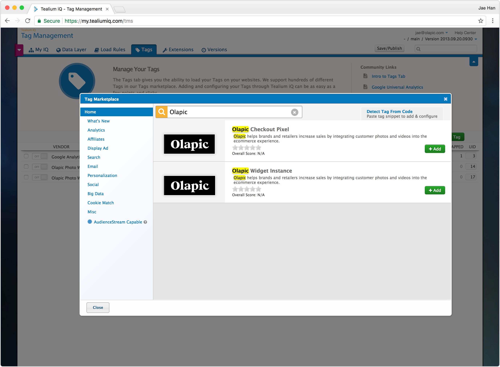

2. In the Tag Configuration screen, type in the fields under the `Vendor Configuration` section. 

    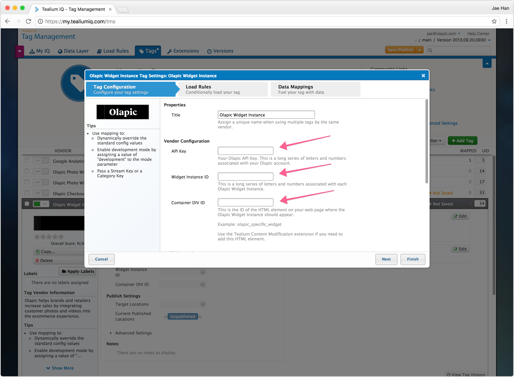

    The `API Key` and `Widget Instance ID` values can be found within the Olapic widget code generated in the Widget Manager section within the Olapic admin (screenshot below). Fill in the appropriate div ID value for the `Container DIV ID`.

    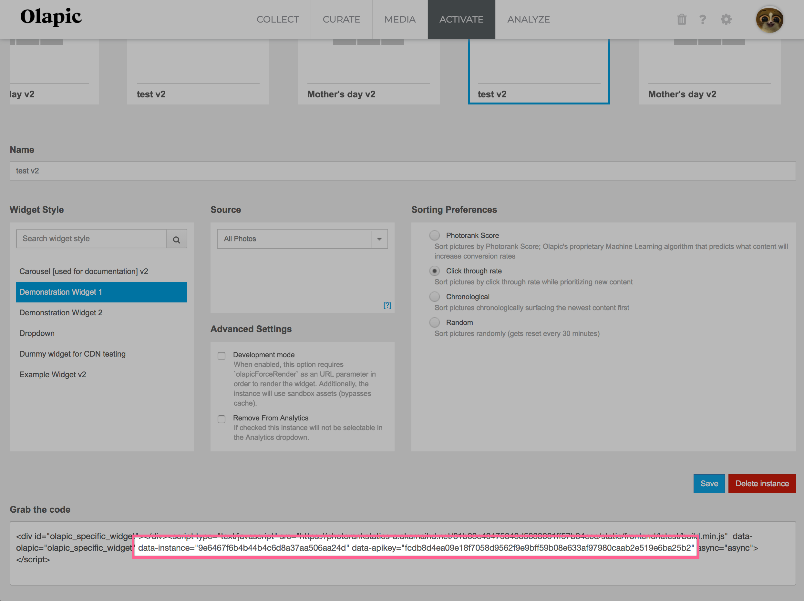

    <div class="bs-callout bs-callout-warning">
      <h4>Container div element must exist</h4>
      The container div with a specific ID that will hold the Olapic widget content is required in the DOM. If the element is not present on the the source level, use the <a href="https://community.tealiumiq.com/t5/iQ-Tag-Management/Content-Modification-Extension/ta-p/12194>"><strong>Tealium Content Modification extension</strong></a> to inject the element dynamically.
    </div>

3. Enable the appopriate Load Rules for the tag. In this example, we are using the rule `dom.pathname CONTAINS index.html`.

    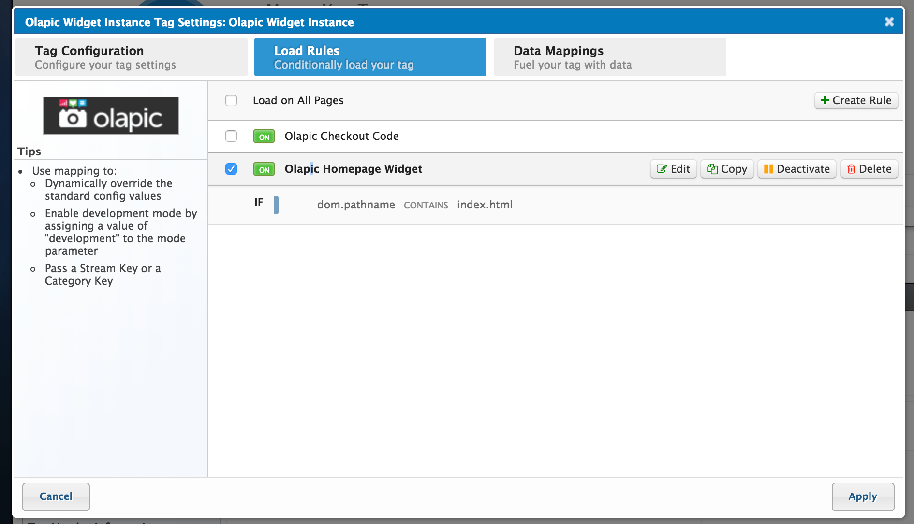

4. Save and publish the changes to the tag in the current profile. Once published, check the site page that matches the load rule to ensure the widget is loading correctly.

    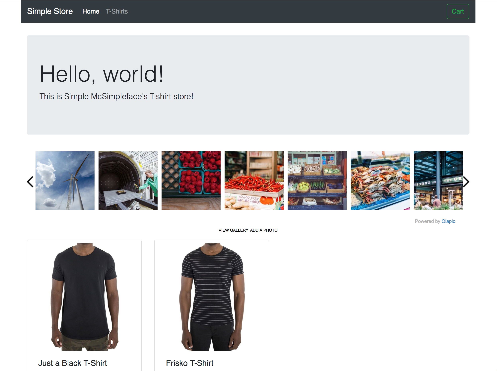

### Dynamic Widget Configuration

The following step-by-step will walk you through the necessarys steps required to configure a **dynamic** type widget (i.e., widget showing content from a specific product stream or product category depending on key value passed on a category or product level page)

1. First, search for "Olapic" in the search in the Tags Marketplace. You should see results for the two Olapic tags. Click the `+ Add` button next to the Olapic Widget Instance tag:

    

2. In the Tag Configuration screen, type in the fields under the `Vendor Configuration` section. 

    

    The `API Key` and `Widget Instance ID` values can be found within the Olapic widget code generated in the Widget Manager section within the Olapic admin (screenshot below). Fill in the appropriate div ID value for the `Container DIV ID`.

    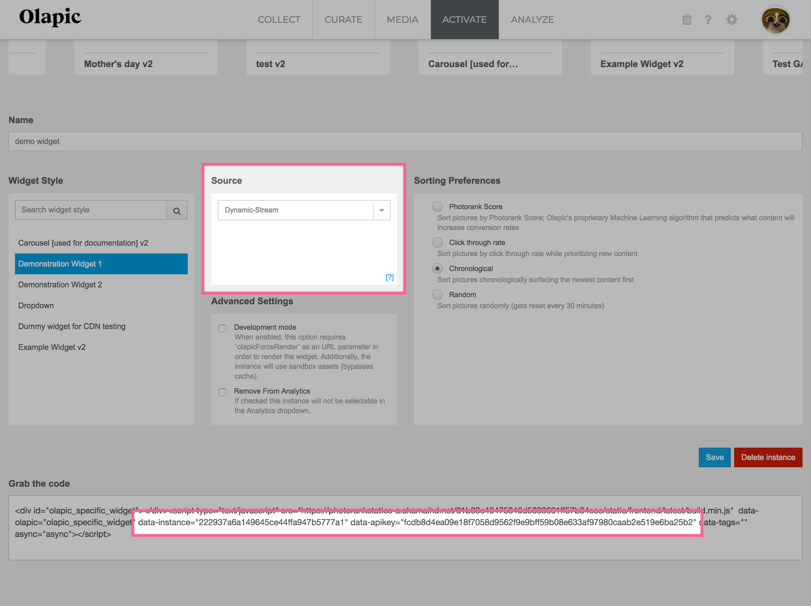

    <div class="bs-callout bs-callout-warning">
      <h4>Set the Widget Source set to Dynamic</h4>
      Be sure to configure the widget to use "Dynamic-Stream" or "Dynamic-Category" when setting up a dynamic widget instance.
    </div>

    <div class="bs-callout bs-callout-warning">
      <h4>Container div element must exist</h4>
      The container div with a specific ID that will hold the Olapic widget content is required in the DOM. If the element is not present on the the source level, use the <a href="https://community.tealiumiq.com/t5/iQ-Tag-Management/Content-Modification-Extension/ta-p/12194>"><strong>Tealium Content Modification extension</strong></a> to inject the element dynamically.
    </div>

3. Enable the appopriate Load Rules for the tag. In this example, we are using the rule `dom.pathname CONTAINS /product/`.

    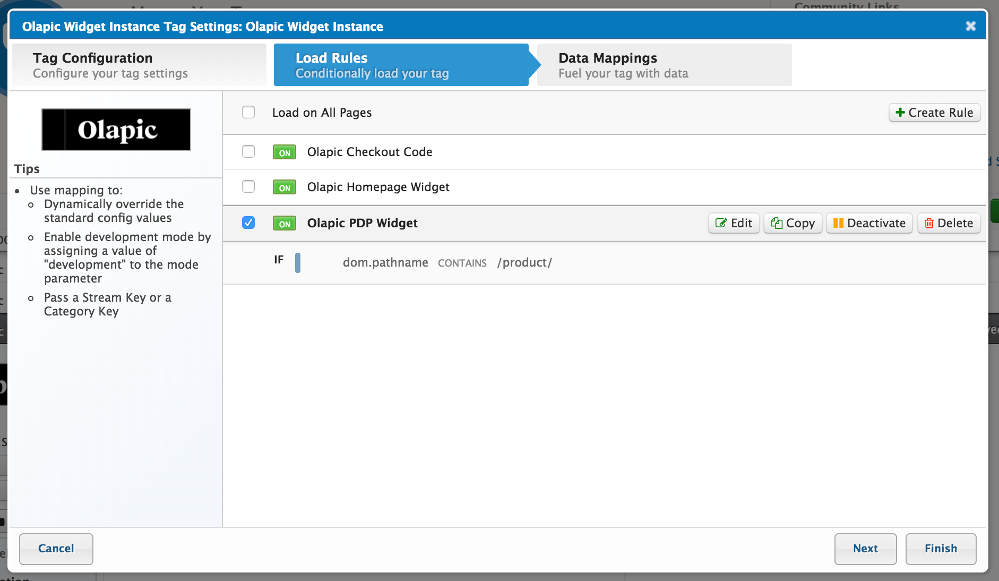

4. Configure the appropriate Data Mapping to pass the *product* or *category* key from the page to the tag. Map the source value to the `Stream Key or Category Key` as the destination.

    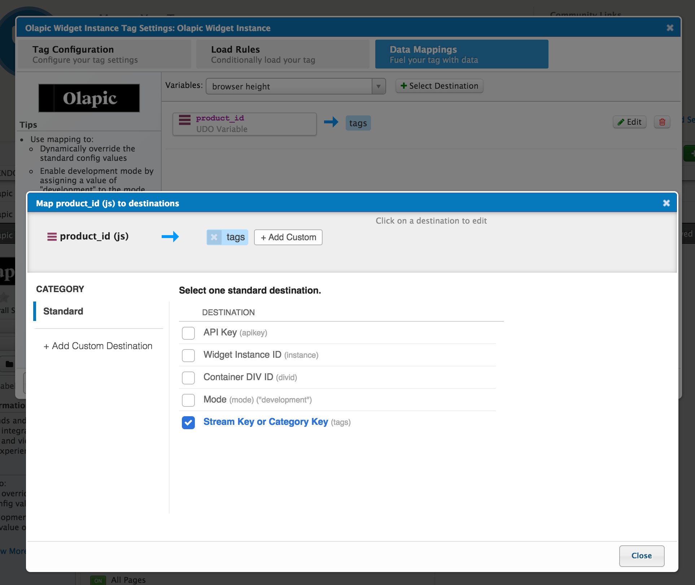

    Additionally, you can use the Data Mapping to load the widget using the Development Mode. For more details around the Development Mode, please see [Technical Overview of the Activate Tab](https://olapic1.zendesk.com/hc/en-us/articles/218238663-Technical-Overview-of-the-Activate-Tab#Development-Mode).

5. Save and publish the changes to the tag in the current profile. Once published, check the page that match the load rule to ensure the widget is loading correctly.

    

### Development Mode
You can use the Data Mapping to load the Olapic widget using the `Development Mode` flag. 

In the below example, we're using the `olapicWidgetMode` as the query parameter key, and pass the value into the `Mode` destination within the tag. 

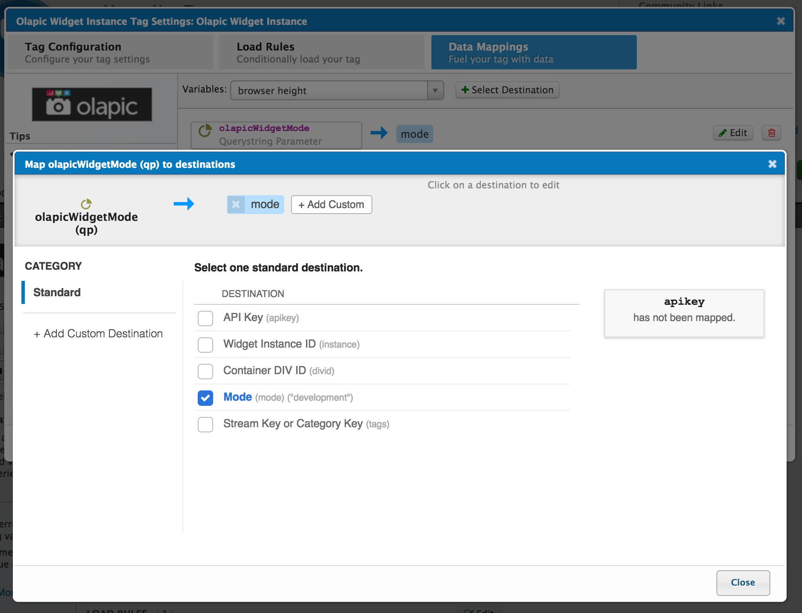

So when the url looks like below, the Olapic Widget will be loaded using the `Development Mode` flag, which loads all of its template assets from the Olapic sandbox environment.

```sh
https://www.mystore.com/products/?olapicWidgetMode=development
```

For more details about the Development Mode, please see [Technical Overview of the Activate Tab](https://olapic1.zendesk.com/hc/en-us/articles/218238663-Technical-Overview-of-the-Activate-Tab#Development-Mode).

## Checkout Pixel Tag

Implementing the Olapic Checkout Code allows you to send important data from your conversion funnel to Olapic. The purpose of this code is to capture the data from the orders made by visitors, and tie the data back to Olapic components installed on your site.

Once implemented, Olapic will be able to analyze the conversion funnel closely, and provide valuable insight in your Analytics dashboard.

Note that the checkout code should be implemented on the order confirmation page. Specifically, on the page after the user has submitted the order to be processed.

### Tag Configuration

The following steps will walk you through how to enable the checkout pixel tag

1. First, search for "Olapic" in the search in the Tags Marketplace. You should see results for the two Olapic tags. Click the `+ Add` button next to the Olapic Widget Instance tag:

    

2. In the Tag Configuration screen, fill in the `API Key` under the `Vendor Configuration` section. 

    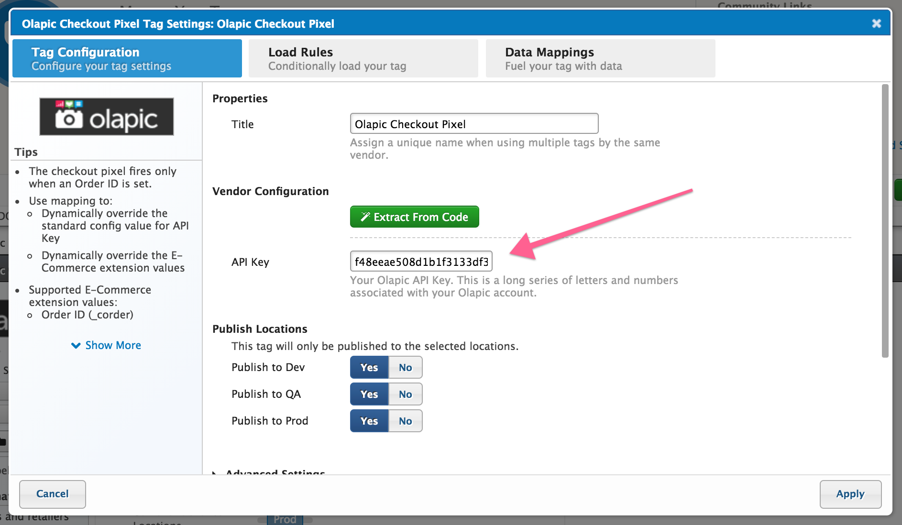

    The `API Key` value can be found in the [Settings page of your Olapic account](https://www.photorank.me/admin/settings#accountbasics).

    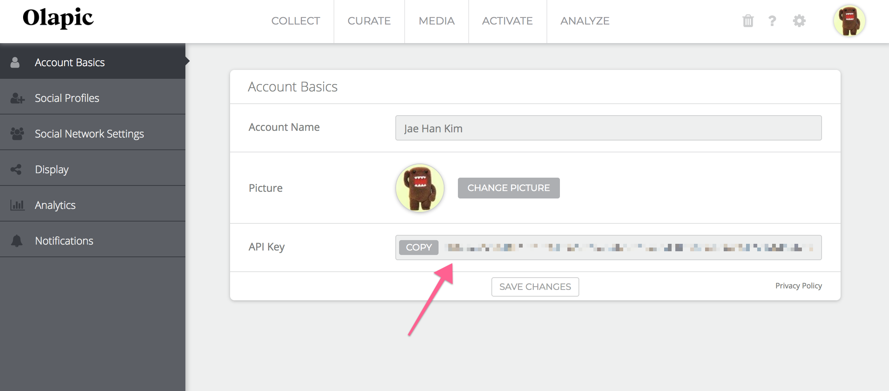

3. Enable the appopriate Load Rules for the tag. In this example, we are using the rule `dom.pathname CONTAINS /checkout/confirmation`. 

    The Load Rule will be different depending on your e-commerce site's configuration.

    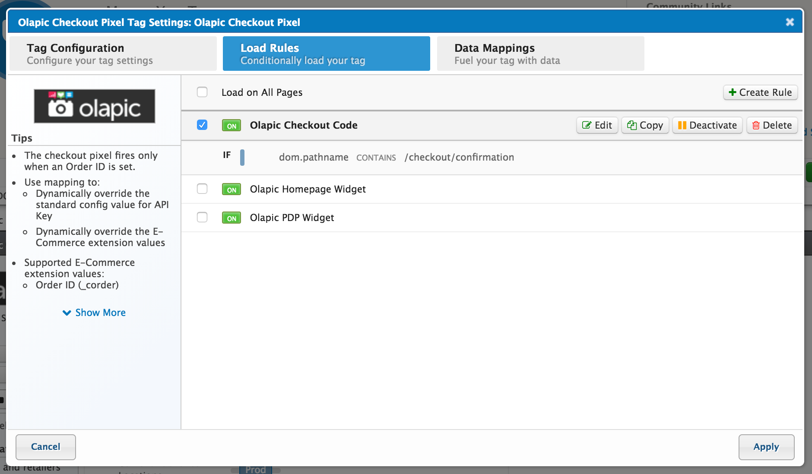

4. The Olapic Checkout Pixel tag is pre-configured to be used with the Tealium E-commerce Extension. If you have the Tealium E-commerce Extension installed already, you do not have to configure the data mapping manually.

    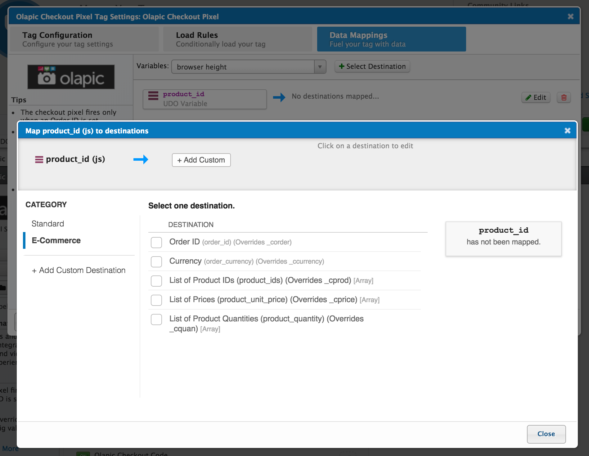

    Example of the E-commerce Extension mapping configuration:

    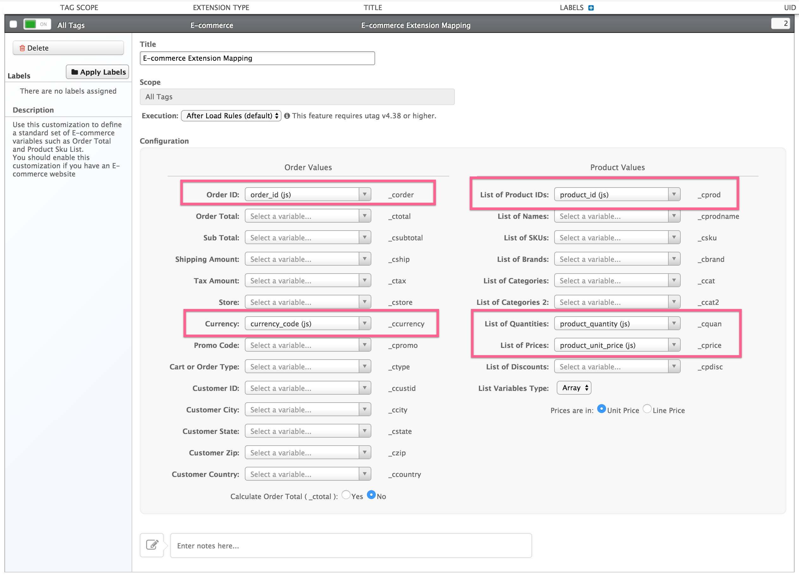

    <div class="bs-callout bs-callout-info">
      <h4>Manually configuring the Data Mapping</h4>
      Depending on your e-commerce site's setup and configuration, the data layer may be exposed using a different method rather than Tealium's UDO (Universal Data Object). If you wish to learn more about the source code of the Checkout Pixel script and the required data mapping, please refer to our <a href="../checkout-pixel-implementation-v2-public.html#instructions">Checkout Pixel Implementation</a> article.
    </div>

5. Save and publish the changes to the tag in the current profile. Once published, complete a full order checkout and ensure that the checkout code is loading correctly. Please refer to the [Checkout Code Validation Guide](../articles/checkout-pixel-validation-guide.html) for the full end-to-end checkout code validation guide.

    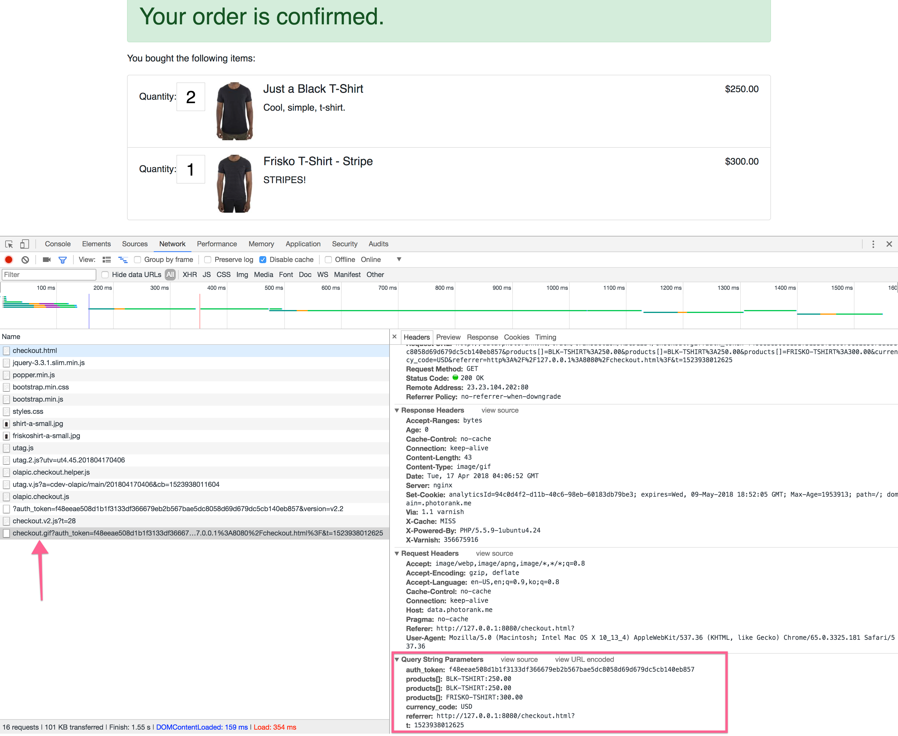
