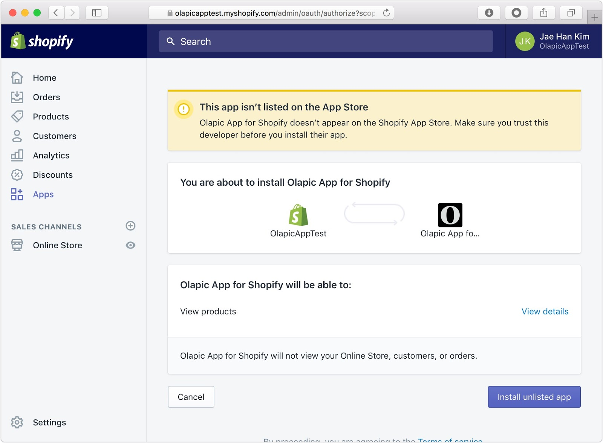
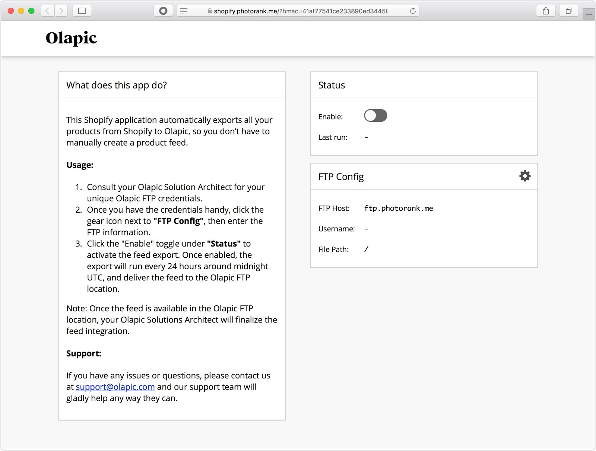
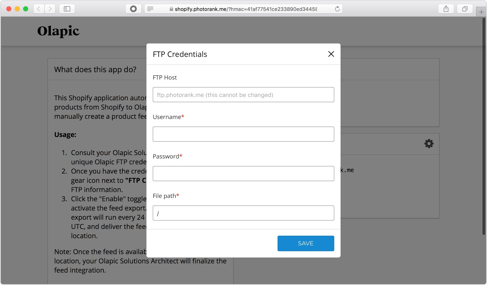

The following document will cover the installation steps & usage of the Olapic Shopify App.

## Overview
Simplifying the product feed integration steps and maintenance, Olapic developed the Olapic App for Shopify, which automatically exports all your products from your Shopify catalog to Olapic, saving time and ensuring accuracy. Specifically, the integration:

1. Eliminates the need for a manually-created product feed using third-party feed plugins.
1. Accurately translates your product catalog into an XML feed in Olapic schema (for more information, please refer to http://developer.olapic.com/articles/product-feed-full-public.html), ensuring proper product & schema matching.
1. Ensures refreshed and up-to-date inventory, as the application will generate an updated feed from your store every 24 hours.

## Table of contents

- [Overview](#overview)
- [Table of contents](#table-of-contents)
- [Installation and Use](#installation-and-use)
  * [Installation](#installation)
  * [Usage](#usage)
  * [Technical Info](#technical-info)
    + [Export Sample](#export-sample)

## Installation and Use

### Installation

1. To install the Olapic Shopify app, navigate to:

    [https://shopify.photorank.me/install?shop=**your_shopify_store_name**](https://shopify.photorank.me/install?shop=your_shopify_store_name)

    Your Shopify store name can be taken from your admin url. For example: `https://<your_shopify_store_name>.myshopify.com/admin/`

2. You will be redirected to your admin, and the install prompt screen will show. Click "Install unlisted app" to continue.

    

3. Once the app is successfully installed, you will see the Olapic app listed alongside the rest of the your Shopify Apps:

    

### Usage

1. After installing the Olapic Shopify app, click on the "Olapic App for Shopify" in the Apps section of the admin. When you first go to the Olapic App, it will look like this:

    

2. Click the "Enable" toggle button under the "Status" card to enable the job. Since you don’t have the FTP configuration details filled out yet, you will have to enter the FTP credentials provided by your Olapic Solutions Architect or Support team.

    

    Please note that you will not be able to save unless you supply authorized credentials. 

3. Once you save you are done! The Olapic app will automatically export your products to the supplied FTP account around midnight UTC.

    If you have any issues or questions, please reach out to us at support@olapic.com and we will gladly assist you.

### Technical Info

The Olapic app currently exports all products and uses collections as categories. It does not currently export child products (variants) but will do so in a later version.

#### Export Sample

Below is an abbreviated export example from the Olapic App for Shopify:

```xml
<?xml version="1.0" encoding="UTF-8"?>
<Feed>
  <Categories>
    <Category>
      <CategoryUniqueID>368571467</CategoryUniqueID>
      <Name>Home page</Name>
      <CategoryUrl>https://olapicapptest.myshopify.com/collections/frontpage</CategoryUrl>
    </Category>
    <Category>
      <CategoryUniqueID>479487371</CategoryUniqueID>
      <Name>test collection</Name>
      <CategoryUrl>https://olapicapptest.myshopify.com/collections/test-collection</CategoryUrl>
    </Category>
    <Category>
      <CategoryUniqueID>368638091</CategoryUniqueID>
      <Name>Test</Name>
      <CategoryUrl>https://olapicapptest.myshopify.com/collections/test</CategoryUrl>
    </Category>
  </Categories>
  <Products>
    <Product>
      <ProductUniqueID>3-4-sleeve-kimono-dress-coral</ProductUniqueID>
      <Name>3/4 Sleeve Kimono Dress</Name>
      <ProductUrl>https://olapicapptest.myshopify.com/product/3-4-sleeve-kimono-dress-coral</ProductUrl>
      <ImageUrl>https://cdn.shopify.com/s/files/1/2311/9657/products/2015-03-20_Ashley_Look_20_23515_15565.jpg?v=1503939788</ImageUrl>
      <CategoriesID>
        <CategoryID>368571467</CategoryID>
        <CategoryID>368638091</CategoryID>
      </CategoriesID>
      <Price>551.60</Price>
      <Stock>7</Stock>
      <Availability>true</Availability>
    </Product>
    <Product>
      <ProductUniqueID>5-panel-hat</ProductUniqueID>
      <Name>5 Panel Camp Cap</Name>
      <ProductUrl>https://olapicapptest.myshopify.com/product/5-panel-hat</ProductUrl>
      <ImageUrl>https://cdn.shopify.com/s/files/1/2311/9657/products/5-panel-hat_4ee20a27-8d5a-490e-a2fc-1f9c3beb7bf5.jpg?v=1503931618</ImageUrl>
      <Price>48.00</Price>
      <Stock>46</Stock>
      <Availability>true</Availability>
    </Product>
  </Products>
</Feed>
```