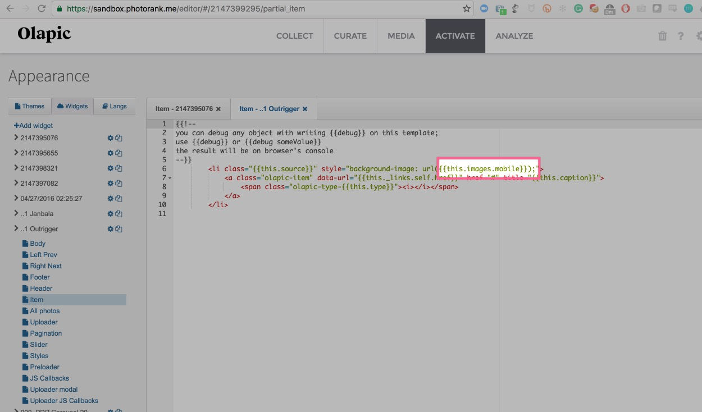
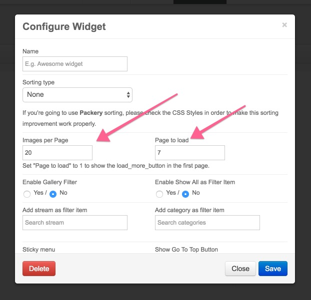

The following document will cover the optimization techniques in regards to the Olapic Javascript Widget implementation.

## Table of Contents

- [Overview](#overview)
- [Load Sequence Control](#load-sequence-control)
  - [Example 1 - Moving the `<script>` Tag](#example---moving-the-script-tag)
  - [Example 2 - Using the SDK Load Method](#example---using-the-sdk-load-method)
- [Use Appropriate Image Size](#use-appropriate-image-size)
- [Lazy Loading Image Assets](#lazy-loading-image-assets)
- [Configure Number of Photos](#configure-number-of-photos)

## Overview
At Olapic, we understand that Olapic Javascript Widgets are implemented across various site environments with varying degrees of third party integrations loaded in parallel.

In efforts to keep the browser resource utilization low, you can follow our best optimization techniques to lower the overall footprint of the Olapic Javascript Widget.

## Load Sequence Control
The `async` attribute in our widget code means that Olapic code will not block any other scripts from loading. However, the browser thread is still allocated to load the Olapic script (as any other resource on the page). If you want to prioritize other scripts ahead of the Olapic script, you can move the script tag towards the bottom of the page or utilize the Olapic SDK load method to manually define when the widget should load (e.g., `$(document).ready`).

Tag management tools are also a great way to control the load sequence of resources on your page.

See below for some specific examples:

### Example 1 - Moving the `<script>` Tag
Place the Olapic `<script>` tag _after_ the scripts that you wish to prioritize. This is the easiest method.

See below for a code example:

```html
<html>
<head>
    <meta charset="UTF-8">
    <title>Example</title>
</head>
<body>
    <div id="olapic_specific_widget"></div>

    <script type="text/javascript" src="script_A.js"></script>
    <script type="text/javascript" src="script_B.js"></script>

    <!-- Olapic script will not load until script A and script B are done loading -->
    <script type="text/javascript" src="https://photorankstatics-a.akamaihd.net/81b03e40475846d5883661ff57b34ece/static/frontend/latest/build.min.js"  data-olapic="olapic_specific_widget" data-instance="a766540c1b6234ec23828cf9c8ec5fc2" data-apikey="f48eeae508d1b1f3133df366679eb2b567bae5dc8058d69d679dc5cb140eb857" async="async"></script>

    <!-- When Olapic script starts to load, it will not block the browser from initiating load for script C -->
    <script type="text/javascript" src="script_C.js"></script>
</body>
</html>
```

**Note:** Please beware that moving the Olapic script lower on the page may result in a delayed "pop-in" effect depending on the speed of the prioritized assets being loaded on the page.

### Example 2 - Using the SDK Load Method 
The Olapic SDK Load method gives you the ability to programmatically invoke the widget load on demand (i.e., `$(document).ready()`).

Please refer to our detailed step-by-step technical guide: [https://olapic1.zendesk.com/hc/en-us/articles/203456360-SDK-Widget-Load-Method](https://olapic1.zendesk.com/hc/en-us/articles/203456360-SDK-Widget-Load-Method).

## Use Appropriate Image Size
Our API provides different versions of the static image assets for you to pick and choose from. Choosing the right image size for different contexts can be a night and day difference.

Please refer to the the **Media Sizing Options** section of our API documentation for more details on the different available assets we provide: [http://apiv2-docs.photorank.me/#header-media-sizing-options](http://apiv2-docs.photorank.me/#header-media-sizing-options)

You can also use different image sizing in the template editor as well:



## Lazy Loading Image Assets
With the Carousel widgets, you can implement custom logic to only load the photos within the user's viewport.

You will find below the sample code to implement the lazy-load functionality for the Olapic Carousel widget. Please make sure to make minor adjustments to the `JS Callbacks` and `Item` templates depending on your existing markup.

**JS Callbacks:**

```html
<script type="text/javascript">
var OlapicCallback = OlapicCallback || {};
OlapicCallback.olapicSliderAfterRender = function(w){
    var $self = oQuery('#' + w.wrapperId);
    var firstLoad = Math.ceil(window.screen.availWidth / 277) + 1;
    
    oQuery('.olapic-carousel .olapic-item', $self).each(function(i, val) { 
        if (i < firstLoad) {
            oQuery(this).css('background-image','url(' + oQuery(this).attr('data-image') + ')').data( 'loaded' , '1' );
        }
    });
    oQuery('.olapic-nav-button', $self).click(function() {
        var $previous = oQuery('.olapic-carousel .olapic-item', $self).filter(function() { 
            return oQuery(this).data('loaded') != true 
        });
        
        if ( oQuery(this).hasClass('olapic-nav-next') ) {
            $previous.first().css('background-image','url(' + $previous.first().attr('data-image') + ')').data('loaded','1');
        } else {
            $previous.last().css('background-image','url(' + $previous.last().attr('data-image') + ')').data('loaded','1');
        }
    });
};
</{{!}}script>
```

**Item:**

```html
<li class="{{this.source}}">
  <a href="#" class="olapic-item" data-url="{{this._links.self.href}}" title="{{this.caption}}" data-image="{{this.images.mobile}}">
    <span class="olapic-type-{{this.type}}"><i></i></span>
  </a>
</li>
```

## Configure Number of Photos
You can optimize the number of photos that initially loads for widgets depending on the use case. 

You can configure this in the respective Widget Configurations:



